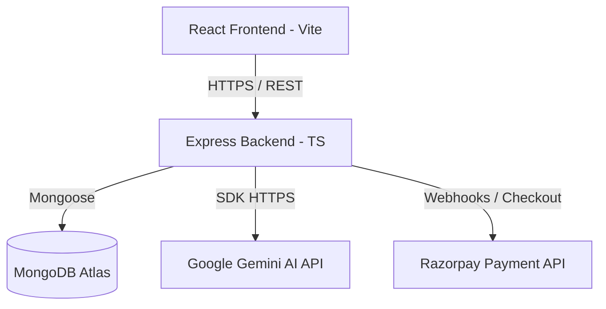
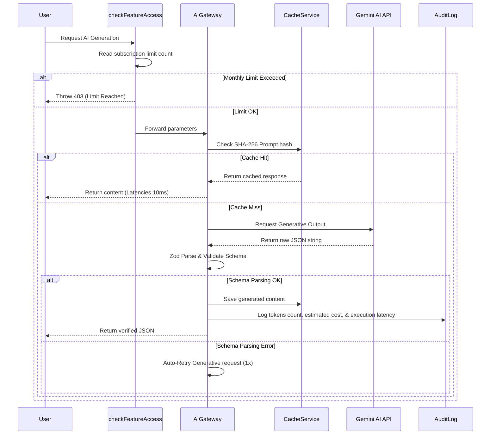

# System Architecture & Data Blueprints

This document outlines the core structural blocks, schemas mapping, and AI flows of the Ascend platform.

---

## 1. System Topology Overview

- **Client SPA**: Connects to the backend APIs using Axios. Enforces responsive layouts, theme styling preferences, and offline drafts fallback caching (Dexie.js).
- **Backend Monolith**: Manages JWT refreshes, checks feature access counts, intercepts routes using RBAC middleware, and directs external traffic.

---

## 2. Core Database Schema Blueprints

### User
- Stores primary metadata (names, target role keywords) and role assignments (`User`, `SuperAdmin`, `Admin`, `Support`, `Moderator`, `Finance`).

### Subscription
- Records active packages (`Free`, `Pro`, `Premium`), renewal dates, and billing histories (invoice objects).

### FeatureUsage
- Tracks monthly credit consumption bounds per user per feature.

### AuditLog
- Security audit logs containing request correlation IDs, IP headers, actions details, and timestamps.

### SupportTicket
- Stores priority tiers (`low`, `medium`, `high`, `critical`), resolution states, internal admin notes, and ticket assignees.

### SystemConfig
- Singleton document managing maintenance toggles, prompt versions performance lists, and dynamic Gemini temperature parameters.

---

## 3. Central AI Gateway Data Flow

- Coordinates rate limits, handles automatic retry fallbacks, parses schema outputs, and maps logs to the MongoDB collections.
