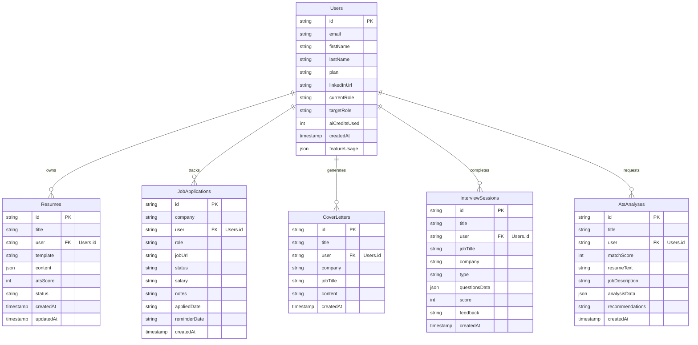

# Relational Database Schema & Analysis

This document details the database architecture of **Ascend** on the Zite platform, derived from [zite.lock](file:///C:/Users/hirem/.gemini/antigravity/scratch/ascend/zite.lock) and [zite.config.json](file:///C:/Users/hirem/.gemini/antigravity/scratch/ascend/zite.config.json).

---

## 1. Database & Tables Overview

The backend integration relies on a relational database configuration with a base identified by the mapping ID **`cc4ba84ae0466dc4`** (named **`Ascend`**). The system registers 6 database tables, each mapped to a specific platform UUID:

| Table Logical Name | Platform Mapping ID | Description |
| :--- | :--- | :--- |
| **`Users`** | `tatFA5oaJtF` | Core accounts table. Synced automatically with Zite authentication sessions. |
| **`Resumes`** | `t1aXX6Yz8sa` | Stores candidate resumes generated in the builder or optimized via the ATS page. |
| **`JobApplications`** | `t5Boo3dg2GB` | Tracks active applications (Kanban and list items). |
| **`CoverLetters`** | `tpM6zGsTcP9` | Stores AI-generated custom cover letters. |
| **`InterviewSessions`** | `ttMmgG3WeJs` | Tracks mock interview questionnaires, answers, and evaluations. |
| **`AtsAnalyses`** | `tp9sDzmydty` | Stores history of resume upload scans, compatibility scores, and recommendations. |

---

## 2. Table Schemas and Fields Mapping

The fields within each table are mapped to UUID tokens by the platform. Below is the list of fields and their UUID identifiers for each table, along with their database types:

### 2.1 Table: `Users` (Mapping: `tatFA5oaJtF`)
*   **`email`** (UUID: `fxwvzVBjeCC`) — *String/Text*. Account email address (Primary Auth sync field).
*   **`firstName`** (UUID: `f2AdzyvcZU7`) — *String/Text*. First name.
*   **`lastName`** (UUID: `fiGadHDGZex`) — *String/Text*. Last name.
*   **`plan`** (UUID: `f2jef1pkSdE`) — *String/Text*. Subscription tier. Values: `'Free'`, `'Premium'`, `'Admin'`. Default: `'Free'`.
*   **`linkedInUrl`** (UUID: `f31gDGUqxw7`) — *String/Text*. User's LinkedIn profile link.
*   **`currentRole`** (UUID: `fvFHFnKMFCw`) — *String/Text*. Professional role details.
*   **`targetRole`** (UUID: `fwmwH6Kmo6A`) — *String/Text*. Target profession interest.
*   **`aiCreditsUsed`** (UUID: `f7WsGq8zzj9`) — *Number*. Counter tracking API token resource loads.
*   **`createdAt`** (UUID: `faw2BDWRNay`) — *DateTime/Timestamp*. Date of signup registration.
*   **`featureUsage`** (UUID: `fwgE6PwJXfp`) — *String/JSON*. Track counts of roadmaps, LinkedIn checks, and project suggestions: e.g., `{"roadmap":1,"linkedin":2,"projects":0}`.
*   *Relations (Platform Virtual Arrays)*:
    *   **`resumes`** (UUID: `fjnYTfGxVY1`) — Reference array of related `Resumes` records.
    *   **`jobApplications`** (UUID: `fr1mA9JwtAf`) — Reference array of related `JobApplications` records.
    *   **`coverLetters`** (UUID: `f7XhVPNZ64y`) — Reference array of related `CoverLetters` records.
    *   **`interviewSessions`** (UUID: `feM8gtL5g2K`) — Reference array of related `InterviewSessions` records.
    *   **`atsAnalyses`** (UUID: `fvCAwAeAuJD`) — Reference array of related `AtsAnalyses` records.

### 2.2 Table: `Resumes` (Mapping: `t1aXX6Yz8sa`)
*   **`title`** (UUID: `f4WUXqMcMFs`) — *String/Text*. Document name (e.g. `'Modern Software Engineer Resume'`).
*   **`user`** (UUID: `fw8AYZZxnmj`) — *Foreign Key*. References `Users.id`.
*   **`template`** (UUID: `f6BhyKXwVTh`) — *String/Text*. Chosen visual stylesheet layout template (e.g. `'Modern'`, `'Minimal'`).
*   **`content`** (UUID: `fgf79faMbgZ`) — *String/JSON*. Complete parsed profile details mapping experience arrays, skills, and projects.
*   **`atsScore`** (UUID: `fwDBkWJLnDF`) — *Number*. Computed compatibility score from analysis.
*   **`status`** (UUID: `f2eK5NXGwVd`) — *String/Text*. State of document (e.g., `'Draft'`, `'Published'`).
*   **`createdAt`** (UUID: `fg5LUtN1GwZ`) — *DateTime/Timestamp*. Create time.
*   **`updatedAt`** (UUID: `f5L6BGmad39`) — *DateTime/Timestamp*. Last save time.

### 2.3 Table: `JobApplications` (Mapping: `t5Boo3dg2GB`)
*   **`company`** (UUID: `f3dVo381NxS`) — *String/Text*. Hiring entity.
*   **`user`** (UUID: `frbKWw8Bvis`) — *Foreign Key*. References `Users.id`.
*   **`role`** (UUID: `fgZJAN2E7H5`) — *String/Text*. Job role.
*   **`jobUrl`** (UUID: `ft1JzHhDEqo`) — *String/Text*. Job listing link.
*   **`status`** (UUID: `fhsCAbp3oQm`) — *String/Text*. Application pipeline status (e.g. `'Wishlist'`, `'Applied'`, `'Interview'`, `'Offer'`, `'Rejected'`, `'Joined'`).
*   **`salary`** (UUID: `f9kAnR24uPb`) — *String/Text*. Compensation details.
*   **`notes`** (UUID: `fbrXZ7dGFni`) — *String/Text*. User notes on application.
*   **`appliedDate`** (UUID: `fpDBgJjPS5C`) — *String/Text (ISO Date)*. Submission date.
*   **`reminderDate`** (UUID: `f7fk1ybCHog`) — *String/Text (ISO Date)*. Follow-up reminder date.
*   **`createdAt`** (UUID: `fnuQijyurAT`) — *DateTime/Timestamp*. Creation timestamp.

### 2.4 Table: `CoverLetters` (Mapping: `tpM6zGsTcP9`)
*   **`title`** (UUID: `fxr1xoiJiq4`) — *String/Text*. Reference name (e.g., `'Google - Product Manager CL'`).
*   **`user`** (UUID: `fpxaoGm24ig`) — *Foreign Key*. References `Users.id`.
*   **`company`** (UUID: `fueKb71tbbr`) — *String/Text*. Target company.
*   **`jobTitle`** (UUID: `fpJEtJaWnLG`) — *String/Text*. Position title.
*   **`content`** (UUID: `ffmbZWR9DZg`) — *String/Text*. Generated markdown cover letter body.
*   **`createdAt`** (UUID: `fxBkhFqVr53`) — *DateTime/Timestamp*. Creation timestamp.

### 2.5 Table: `InterviewSessions` (Mapping: `ttMmgG3WeJs`)
*   **`title`** (UUID: `fovTnCemEib`) — *String/Text*. Session title (e.g., `'Mock HR Interview - Amazon'`).
*   **`user`** (UUID: `famS2jzBUXo`) — *Foreign Key*. References `Users.id`.
*   **`jobTitle`** (UUID: `fnmipaHs5wa`) — *String/Text*. Target position.
*   **`company`** (UUID: `fbQKwSUWoEp`) — *String/Text*. Target company.
*   **`type`** (UUID: `f3hMNFhDiGA`) — *String/Text*. Interview focus (e.g., `'hr'`, `'technical'`, `'behavioral'`).
*   **`questionsData`** (UUID: `fjQ1b2JMRMD`) — *String/JSON*. JSON array containing questions, hints, sample answers, and user responses.
*   **`score`** (UUID: `fhq7F1HjN3o`) — *Number*. Computed average score (0-100).
*   **`feedback`** (UUID: `fjEnojDKw1H`) — *String/Text*. Evaluator notes.
*   **`createdAt`** (UUID: `f4wJsiugHUe`) — *DateTime/Timestamp*. Session start timestamp.

### 2.6 Table: `AtsAnalyses` (Mapping: `tp9sDzmydty`)
*   **`title`** (UUID: `foPpUUpysiR`) — *String/Text*. Scan reference name (e.g., `'ATS Analysis - July 9'`).
*   **`user`** (UUID: `fasxqiWhJfs`) — *Foreign Key*. References `Users.id`.
*   **`matchScore`** (UUID: `fsqb3am8Abr`) — *Number*. Overall ATS match percentage (0-100).
*   **`resumeText`** (UUID: `fmtMeeNM5zw`) — *String/Text*. Parsed text content from uploaded document.
*   **`jobDescription`** (UUID: `f3UrYDZUnkM`) — *String/Text*. Target job description text.
*   **`analysisData`** (UUID: `f6e8wNoi5ku`) — *String/JSON*. Detailed feedback on keywords, categories, and formatting.
*   **`recommendations`** (UUID: `fvn1ERQxJSQ`) — *String/Text*. Detailed list of bullet point suggestions.
*   **`createdAt`** (UUID: `f2Xg8H5dEwk`) — *DateTime/Timestamp*. Date of analysis.

---

## 3. Relationships and Constraints

The database utilizes standard relational model patterns:

*   **Cascade / Delete Constraints**: Tables link to the `Users` table through the user foreign key. If a user account is deleted, all dependent assets (resumes, tracking steps, cover letters, mock interviews, scans) must cascade delete to maintain database integrity.
*   **Implicit References**: Relationships are resolved at runtime by matching context parameters. For example, `context.user.id` is used to filter records during queries like `Resumes.findAll({ filters: { user: context.user.id } })`.

---

## 4. Query & Mutation Patterns

API endpoint handlers interact with Zite tables using the following patterns:

*   **Single Fetch (Read)**:
    `const r = await Resumes.findOne({ id: input.id });`
*   **Filtered List Fetch (Read)**:
    `const { records } = await Resumes.findAll({ filters: { user: context.user.id } });`
*   **Record Creation (Write)**:
    `const r = await Resumes.create({ record: { title, content, user: context.user.id } });`
*   **Record Update (Write)**:
    `await Resumes.update({ id: input.id, record: { title, content } });`
*   **Record Deletion (Write)**:
    `await Resumes.delete({ id: input.id });`
