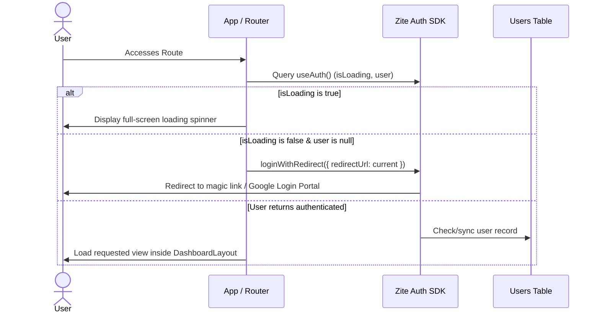
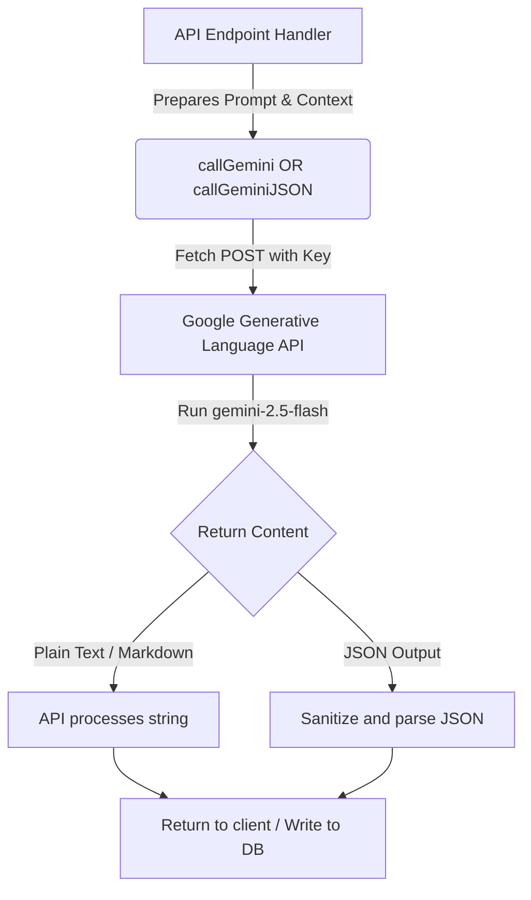

# Core Application Workflows & Functional Analysis

This document provides a detailed breakdown of all user interaction flows, state machines, and system steps across Ascend's features.

---

## 1. Authentication Flow
Managed in [src/components/DashboardLayout.tsx](file:///C:/Users/hirem/.gemini/antigravity/scratch/ascend/src/components/DashboardLayout.tsx) via `zite-auth-sdk`:

---

## 2. Payment & Subscription Flow
Enables lifetime access upgrade to Pro plan for ₹89.00, handled by [UpgradeModal.tsx](file:///C:/Users/hirem/.gemini/antigravity/scratch/ascend/src/components/UpgradeModal.tsx):

1.  **Trigger**: User triggers upgrade via "Upgrade to Pro" banner in sidebar, settings tab, or by exceeding feature limits.
2.  **SDK Script Load**: Loads script `https://checkout.razorpay.com/v1/checkout.js` into the DOM.
3.  **Order Registration**: Calls the `createRazorpayOrder` API, which communicates with Razorpay's `/orders` endpoint to create a transaction token for 8900 paise (₹89.00 INR).
4.  **Checkout Modal UI**: Launches the Razorpay checkout overlay.
5.  **Payment Verification**: On successful payment, the modal triggers the `handler` callback, passing `razorpayOrderId`, `razorpayPaymentId`, and `razorpaySignature`.
6.  **Server Signature Verification**: Sends payload data to the `verifyRazorpayPayment` API. The server re-signs the payload using the `ZITE_RAZORPAY_KEY_SECRET` private key. On match, it updates the user's plan to `'Premium'` in the `Users` database.
7.  **Resolution**: Shows success toast, closes modal, and reloads page to apply the upgraded state.

---

## 3. Gemini AI Execution Flow
All generative AI calls run server-side via [src/lib/gemini.ts](file:///C:/Users/hirem/.gemini/antigravity/scratch/ascend/src/lib/gemini.ts) to protect the API key:

*   **Multimodal Parsing**: Used in `analyzeATS.ts` to parse uploaded PDF resumes. It posts base64 binary strings to Gemini under `application/pdf` MIME type headers to extract formatting and structures.
*   **JSON Enforcement**: System prompts append structured TypeScript interfaces and JSON constraints to ensure output parsing compatibility.

---

## 4. Resume Builder & Editor Workflow
Handled by [ResumeBuilder.tsx](file:///C:/Users/hirem/.gemini/antigravity/scratch/ascend/src/pages/ResumeBuilder.tsx) and [ResumeEditor.tsx](file:///C:/Users/hirem/.gemini/antigravity/scratch/ascend/src/pages/ResumeEditor.tsx):

1.  **Dashboard Load**: `ResumeBuilder` fetches a list of resumes (`getResumes`).
2.  **Creation Dialog**: Clicking "Add Resume" prompts for a title and template (e.g., Modern, Minimal, Tech). Saves a draft resume with default content.
3.  **Editor Load**: Redirects to `/resumes/:id`. `ResumeEditor` fetches resume details (`getResume`) and parses the stringified JSON content block into React state.
4.  **Input Editing**: Tabs group form fields:
    *   **Personal**: Name, Email, Phone, Title, Location, Summary.
    *   **Experience**: Array entries for Role, Company, Dates, and Bullet Descriptions. Includes a "Suggest with AI" trigger that calls `optimizeResume` for specific lines.
    *   **Education**: Degrees, Schools, and Graduation Years.
    *   **Skills**: Add tags to string array.
    *   **Projects**: Project names and descriptions.
5.  **Save System**:
    *   **Auto-save**: Uses a debounced callback (`useDebouncedCallback` at 2000ms delay) to automatically save changes to the database while typing.
    *   **Manual Save**: Saves changes instantly to `saveResume` and displays a toast notification.
6.  **PDF Export**: Formats the resume content into HTML/CSS, then calls `ZitePdf.renderHtml` via the `exportResumePdf` API to return a downloadable PDF link.

---

## 5. ATS Analyzer & Optimizer Workflow
Handled by [AtsAnalyzer.tsx](file:///C:/Users/hirem/.gemini/antigravity/scratch/ascend/src/pages/AtsAnalyzer.tsx):

1.  **Check Credits**: Verifies usage permissions by calling `checkFeatureAccess` with `ats` key.
2.  **Data Input**:
    *   *Upload Mode*: Drag-and-drop or select PDF/DOCX file. Uploads the file via `uploadFile` to get a public URL.
    *   *Paste Mode*: Input text directly into a text area.
    *   *Job Description*: Input job requirements to tailor the analysis.
3.  **Analysis Execution**: Sends the inputs to the `analyzeATS` API. The endpoint parses the document, analyzes keywords against the job description using Gemini, scores compatibility (0-100), and creates an `AtsAnalyses` record.
4.  **Dashboard Display**: Displays scores, categories breakdown, list of found/missing keywords, and optimization recommendations.
5.  **AI Optimization**: The user can click "Optimize Resume" to trigger `optimizeResumeATS`. Gemini generates a fully rewritten, optimized version of the resume.
6.  **Result Retrieval**: The page displays the optimized text with copy and download buttons.

---

## 6. Career Roadmap & SOP Workflow
Handled by [CareerRoadmap.tsx](file:///C:/Users/hirem/.gemini/antigravity/scratch/ascend/src/pages/CareerRoadmap.tsx):

1.  **Dashboard Recommendations**: Loads suggested career path roles using `suggestRoles`, which matches the candidate's skills against current market demand.
2.  **SOP Action Plan**: Clicking a recommended role triggers `generateRoleSOP`. Gemini generates a step-by-step career path template with training phases, step actions, deliverables, certifications, and target projects.
3.  **Custom Roadmap Builder**: The user can manually input their current role, target role, skills, and experience, then click "Generate Roadmap" to run `generateRoadmap`. This outputs a monthly timeline mapping key milestones, skill-acquisition pathways, and estimated target salary changes.

---

## 7. Interactive Mock Interview Workflow
Handled by [InterviewPrep.tsx](file:///C:/Users/hirem/.gemini/antigravity/scratch/ascend/src/pages/InterviewPrep.tsx):

1.  **Setup Phase**: User enters target job title, company name, and interview focus category (HR, Technical, or Behavioral).
2.  **Question Generation**: Calls `generateInterviewQuestions` to fetch 5 realistic mock questions with answer tips.
3.  **Active Session**: Displays questions one by one. The user inputs their answers in a text area and navigates using next/back buttons.
4.  **Evaluation Phase**: On submit, sends the user's answers to the `scoreInterview` API. Gemini scores the responses, writes the overall feedback, and saves the results to `InterviewSessions`.
5.  **Analysis View**: Displays the overall score, performance evaluation, and question-level feedback (strengths and areas of improvement).

---

## 8. Cover Letter Generator Workflow
Handled by [CoverLetterGenerator.tsx](file:///C:/Users/hirem/.gemini/antigravity/scratch/ascend/src/pages/CoverLetterGenerator.tsx):

1.  **Input Collection**: User provides the company name, target job title, job description, optional resume text, and tone (e.g., Professional, Creative, Confident).
2.  **Letter Drafting**: Sends the details to the `generateCoverLetter` API, which draft the cover letter using Gemini, saves it to `CoverLetters`, and returns it.
3.  **Listing View**: Displays generated cover letters on a side panel for quick access, copy, or deletion.

---

## 9. LinkedIn Profile Optimization Workflow
Handled by [LinkedInReview.tsx](file:///C:/Users/hirem/.gemini/antigravity/scratch/ascend/src/pages/LinkedInReview.tsx):

1.  **Form Input**: User enters their current LinkedIn Headline, About section, and Experience details.
2.  **Analysis**: Sends the text to the `reviewLinkedIn` API. Gemini scores each section and generates optimized rewrites.
3.  **Display**: Displays a section-by-section comparison (current vs. optimized) with key tips, scores, and copy buttons.

---

## 10. Dashboard Analytics Workflow
Handled by [Dashboard.tsx](file:///C:/Users/hirem/.gemini/antigravity/scratch/ascend/src/pages/Dashboard.tsx):

1.  **Component Mount**: Triggers `getDashboardStats` on load.
2.  **Data Processing**: Queries metrics from `Resumes`, `JobApplications`, `CoverLetters`, and `InterviewSessions`.
3.  **UI Render**: Displays:
    *   Total counts and average scores (ATS compatibility, mock interview grades).
    *   Quick actions to open tools.
    *   Visual progress mapping job applications through Kanban board columns.
    *   List of recent ATS analyses.

---

## 11. Kanban Job Tracker Workflow
Handled by [JobTracker.tsx](file:///C:/Users/hirem/.gemini/antigravity/scratch/ascend/src/pages/JobTracker.tsx):

1.  **Load View**: Fetches job application records using `getJobApplications`.
2.  **Board View**: Organizes applications into Kanban columns: Wishlist, Applied, Interview, Offer, Rejected, Joined.
3.  **List View**: Displays applications in a structured table.
4.  **Drag and Drop/Status Updates**: Changing an application's status triggers `saveJobApplication` to update the record in the database.
5.  **Edit / Delete Dialog**: User can modify application details (salary, notes, reminder dates) or delete the entry entirely.

---

## 12. User Profile & Settings Workflow
Handled by [Settings.tsx](file:///C:/Users/hirem/.gemini/antigravity/scratch/ascend/src/pages/Settings.tsx):

1.  **Load State**: Reads user details (name, email, plan, LinkedIn URL, target role) from the authenticated session context.
2.  **Save Profile Changes**: Updates profile details in the `Users` table by calling `updateProfile`.
3.  **Upgrade Plan Trigger**: Displays current plan state. If the user is on the Free tier, displays the "Upgrade to Pro" checkout button.
